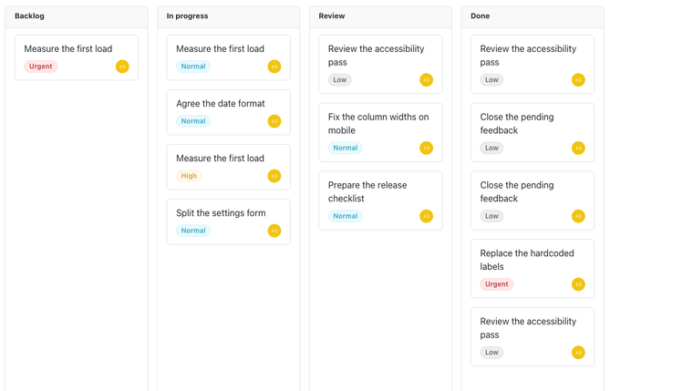
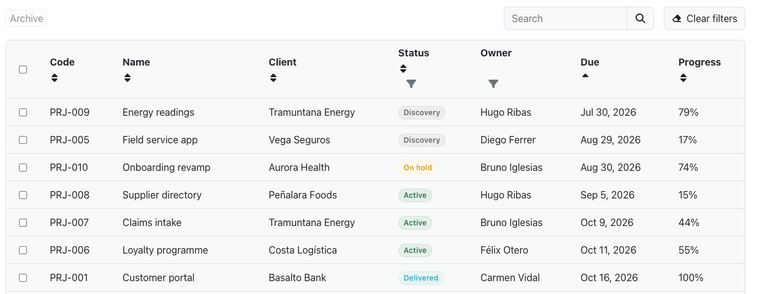
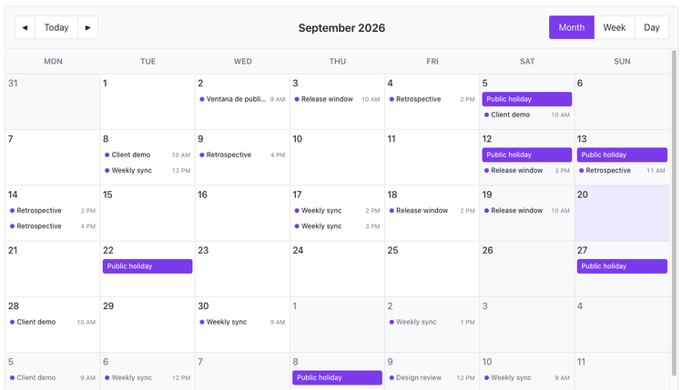
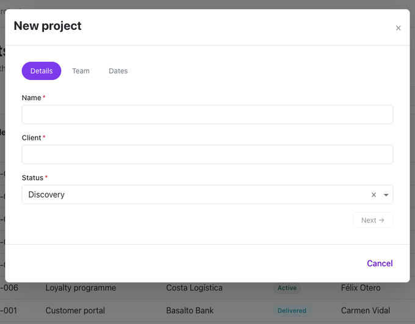
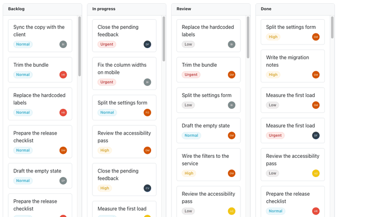

<p align="center">
  <a href="https://hubui.dev/es/">
    
  </a>
</p>

<h3 align="center">Componentes Angular para lo que no quieres volver a construir.</h3>

<p align="center">
  Tablas de datos, tableros kanban, calendarios, campos de formulario, steppers y modales para Angular 22.<br>
  Cada uno es un paquete npm aparte: instalas el componente que necesitas y nada más.
</p>

<p align="center">
  <a href="https://hubui.dev/es/"><strong>Documentación</strong></a> ·
  <a href="https://hubui.dev/es/paginable/examples/"><strong>Ejemplos en vivo</strong></a> ·
  <a href="#paquetes"><strong>Paquetes</strong></a> ·
  <a href="ROADMAP.md"><strong>Roadmap</strong></a> ·
  <a href="https://github.com/hub-env/hub-ui/stargazers"><strong>Dale una estrella</strong></a>
</p>

<p align="center">
  <a href="https://github.com/hub-env/hub-ui/stargazers"></a>
  <a href="https://angular.dev"></a>
  <a href="#paquetes"></a>
  <a href="LICENSE"></a>
</p>

**Español** | [English](README.md)

> **Dónde está el código.** Este repositorio no contiene código propio: es la puerta de
> entrada y el gestor de incidencias común de la familia. Cada paquete vive en su propio
> repositorio, con licencia MIT, dentro de la [organización hub-env](https://github.com/hub-env)
> — por ejemplo [`ng-hub-ui-paginable`](https://github.com/hub-env/ng-hub-ui-paginable) o
> [`ng-hub-ui-modal`](https://github.com/hub-env/ng-hub-ui-modal). La [tabla de
> paquetes](#paquetes) enlaza cada uno con su código, su página de npm y su documentación.

---

## Por qué Hub UI

Un framework de UI completo trae su tema, su sistema de maquetación y su forma de montar formularios. Hub UI está dividido en paquetes: si tu aplicación ya tiene su aspecto y solo necesitas una tabla con paginación en servidor, instalas `ng-hub-ui-paginable` y ya está.

Los paquetes cubren los componentes que cuesta semanas dejar bien y que los equipos acaban rehaciendo de un proyecto a otro:

- **Tabla de datos** con paginación en servidor, búsqueda, filtros por columna, ordenación, selección y reordenación de filas.
- **Tablero kanban** con arrastrar y soltar nativo. No depende de Angular CDK.
- **Calendario** con vistas de mes, semana, día y año, y eventos que se cambian de fecha arrastrándolos.
- **Campos de formulario** (input, OTP, select, datepicker, timepicker, slider, subida de ficheros) que muestran solos los errores de validación.
- **Stepper**, **modal**, **toast**, **navegación** y una docena de piezas más pequeñas.

Todos los componentes son standalone, usan signals y `OnPush`, y siguen WCAG 2.1 AA, con soporte de teclado y avisos para lectores de pantalla. El estilo se controla con propiedades CSS personalizadas: el sistema de diseño documenta más de 2.000 variables `--hub-*` e incluye ocho temas, entre ellos el claro y el oscuro.

## Empezar

Instala el paquete que necesitas:

```bash
npm install ng-hub-ui-board ng-hub-ui-utils
```

Importa el componente y úsalo:

```ts
import { Component, signal } from '@angular/core';
import { Board, HubBoardComponent, HubCardTemplateDirective } from 'ng-hub-ui-board';

@Component({
	selector: 'app-sprint-board',
	imports: [HubBoardComponent, HubCardTemplateDirective],
	template: `
		<hub-board [board]="board()">
			<ng-template cardTpt let-card="item">
				<strong>{{ card.title }}</strong>
			</ng-template>
		</hub-board>
	`
})
export class SprintBoardComponent {
	board = signal<Board>({
		title: 'Sprint 14',
		columns: [
			{ title: 'To do', cards: [{ title: 'Login page' }] },
			{ title: 'Done', cards: [{ title: 'Project scaffold' }] }
		]
	});
}
```

La página de cada paquete en [hubui.dev](https://hubui.dev/es/) tiene la API completa, ejemplos en vivo y la lista de variables CSS que lee.

El instalador, todavía en pre-release, también puede preguntarte qué librerías quieres y configurarlas en tu aplicación:

```bash
ng add ng-hub-ui
```

## Verlo en marcha

**[demo.hubui.dev](https://demo.hubui.dev/)** es una aplicación de gestión de
proyectos hecha solo con estos paquetes: no hay otro framework de interfaz en su
árbol de dependencias. El código está en
[hub-env/hub-ui-admin-demo](https://github.com/hub-env/hub-ui-admin-demo).

### Un tablero kanban que también se mueve con el teclado

Espacio agarra la tarjeta, las flechas la mueven, Espacio la suelta.



### Una tabla que pagina en el servidor

La página, la búsqueda, los filtros y el orden viajan al servicio.



### Un calendario en mes, semana y día



### El stepper, el modal y los campos de formulario, juntos

Cada paso queda cerrado hasta que el anterior es válido.



### Un panel lateral para el detalle



### Ejemplos en vivo, paquete a paquete

Cada paquete tiene una página de ejemplos en vivo que puedes probar y copiar:

- [Tablero kanban](https://hubui.dev/es/board/examples/): tarjetas y columnas que se arrastran, plantillas propias y movimiento con teclado.
- [Tabla de datos](https://hubui.dev/es/paginable/examples/): paginación en servidor, filtros, selección y reordenación de filas.
- [Calendario](https://hubui.dev/es/calendar/examples/): vistas de mes, semana, día y año, y eventos que se mueven arrastrando.
- [Campos de formulario](https://hubui.dev/es/forms/examples/): datepicker, select, OTP, subida de ficheros y mensajes de validación.
- [Stepper](https://hubui.dev/es/stepper/examples/) y [modal](https://hubui.dev/es/modal/examples/).

## Paquetes

Todos los paquetes se publican en npm con el prefijo `ng-hub-ui-*`. Su versión mayor coincide con la de Angular a la que se dirigen: `22.x` es para Angular 22.

### Datos y estructura

| Paquete | Qué hace | Enlaces |
| --- | --- | --- |
| `ng-hub-ui-paginable` | Tabla de datos y lista jerárquica: paginación, búsqueda, filtros por columna, ordenación, selección y reordenación arrastrando, además de un paginador independiente | [docs](https://hubui.dev/es/paginable/overview/) · [npm](https://www.npmjs.com/package/ng-hub-ui-paginable) · [código](https://github.com/hub-env/ng-hub-ui-paginable) |
| `ng-hub-ui-board` | Tablero kanban con arrastrar y soltar nativo, sin Angular CDK | [docs](https://hubui.dev/es/board/overview/) · [npm](https://www.npmjs.com/package/ng-hub-ui-board) · [código](https://github.com/hub-env/ng-hub-ui-board) |
| `ng-hub-ui-calendar` | Vistas de mes, semana, día y año; los eventos se cambian de fecha arrastrándolos | [docs](https://hubui.dev/es/calendar/overview/) · [npm](https://www.npmjs.com/package/ng-hub-ui-calendar) · [código](https://github.com/hub-env/ng-hub-ui-calendar) |
| `ng-hub-ui-sortable` | Reordenación arrastrando para arrays, signals y `FormArray`, también con teclado | [docs](https://hubui.dev/es/sortable/overview/) · [npm](https://www.npmjs.com/package/ng-hub-ui-sortable) · [código](https://github.com/hub-env/ng-hub-ui-sortable) |
| `ng-hub-ui-panels` | Pestañas, píldoras, acordeón o tarjetas con una sola API, y un panel lateral no modal | [docs](https://hubui.dev/es/panels/overview/) · [npm](https://www.npmjs.com/package/ng-hub-ui-panels) · [código](https://github.com/hub-env/ng-hub-ui-panels) |
| `ng-hub-ui-nav` | Menús horizontales, barras laterales, offcanvas, menús flotantes y navegación por niveles | [docs](https://hubui.dev/es/nav/overview/) · [npm](https://www.npmjs.com/package/ng-hub-ui-nav) · [código](https://github.com/hub-env/ng-hub-ui-nav) |
| `ng-hub-ui-breadcrumbs` | Migas de pan generadas a partir de la configuración del router | [docs](https://hubui.dev/es/breadcrumbs/overview/) · [npm](https://www.npmjs.com/package/ng-hub-ui-breadcrumbs) · [código](https://github.com/hub-env/ng-hub-ui-breadcrumbs) |
| `ng-hub-ui-stepper` | Asistente de formularios por pasos, en vertical, con barra lateral y en RTL | [docs](https://hubui.dev/es/stepper/overview/) · [npm](https://www.npmjs.com/package/ng-hub-ui-stepper) · [código](https://github.com/hub-env/ng-hub-ui-stepper) |

### Formularios

| Paquete | Qué hace | Enlaces |
| --- | --- | --- |
| `ng-hub-ui-forms` | Input, OTP, textarea, slider, segmented, select, datepicker, timepicker y subida de ficheros, con mensajes de validación automáticos | [docs](https://hubui.dev/es/forms/overview/) · [npm](https://www.npmjs.com/package/ng-hub-ui-forms) · [código](https://github.com/hub-env/ng-hub-ui-forms) |
| `ng-hub-ui-signature` | Campo de firma en SVG que se firma con puntero o con teclado, con deshacer/rehacer y exportación a PNG | [docs](https://hubui.dev/es/signature/overview/) · [npm](https://www.npmjs.com/package/ng-hub-ui-signature) · [código](https://github.com/hub-env/ng-hub-ui-signature) |
| `ng-hub-ui-history` | Store de deshacer/rehacer basado en signals, con diffs, transacciones y seguimiento de formularios | [docs](https://hubui.dev/es/history/overview/) · [npm](https://www.npmjs.com/package/ng-hub-ui-history) · [código](https://github.com/hub-env/ng-hub-ui-history) |

### Superposiciones y avisos

| Paquete | Qué hace | Enlaces |
| --- | --- | --- |
| `ng-hub-ui-modal` | Modales a partir de un `TemplateRef`, un componente o un texto; anclados a un borde, como panel offcanvas, apilados y con el foco atrapado | [docs](https://hubui.dev/es/modal/overview/) · [npm](https://www.npmjs.com/package/ng-hub-ui-modal) · [código](https://github.com/hub-env/ng-hub-ui-modal) |
| `ng-hub-ui-toast` | Notificaciones toast con observables de ciclo de vida, barra de progreso y seis posiciones | [docs](https://hubui.dev/es/toast/overview/) · [npm](https://www.npmjs.com/package/ng-hub-ui-toast) · [código](https://github.com/hub-env/ng-hub-ui-toast) |
| `ng-hub-ui-action-sheet` | Action sheets pensados para móvil, con acciones agrupadas y cierre deslizando | [docs](https://hubui.dev/es/action-sheet/overview/) · [npm](https://www.npmjs.com/package/ng-hub-ui-action-sheet) · [código](https://github.com/hub-env/ng-hub-ui-action-sheet) |
| `ng-hub-ui-loading` | Indicadores de carga en línea, superpuestos o a pantalla completa, y una barra de progreso conectada al router y a `HttpClient` | [docs](https://hubui.dev/es/loading/overview/) · [npm](https://www.npmjs.com/package/ng-hub-ui-loading) · [código](https://github.com/hub-env/ng-hub-ui-loading) |
| `ng-hub-ui-skeleton` | Esqueletos de carga descritos con una sintaxis parecida a Emmet | [docs](https://hubui.dev/es/skeleton/overview/) · [npm](https://www.npmjs.com/package/ng-hub-ui-skeleton) · [código](https://github.com/hub-env/ng-hub-ui-skeleton) |
| `ng-hub-ui-portal` | Servicio que pinta componentes y plantillas en cualquier punto del DOM | [docs](https://hubui.dev/es/portal/overview/) · [npm](https://www.npmjs.com/package/ng-hub-ui-portal) · [código](https://github.com/hub-env/ng-hub-ui-portal) |

### Visualización

| Paquete | Qué hace | Enlaces |
| --- | --- | --- |
| `ng-hub-ui-buttons` | Botones (cinco variantes y nueve acentos), botón flotante, speed dial y una directiva de desplegable | [docs](https://hubui.dev/es/buttons/overview/) · [npm](https://www.npmjs.com/package/ng-hub-ui-buttons) · [código](https://github.com/hub-env/ng-hub-ui-buttons) |
| `ng-hub-ui-avatar` | Avatares desde Gravatar, GitHub, iniciales, imágenes o iconos proyectados | [docs](https://hubui.dev/es/avatar/overview/) · [npm](https://www.npmjs.com/package/ng-hub-ui-avatar) · [código](https://github.com/hub-env/ng-hub-ui-avatar) |
| `ng-hub-ui-badges` | Badges, píldoras de estado y etiquetas de filtro que se pueden quitar | [docs](https://hubui.dev/es/badges/overview/) · [npm](https://www.npmjs.com/package/ng-hub-ui-badges) · [código](https://github.com/hub-env/ng-hub-ui-badges) |
| `ng-hub-ui-icons` | Una sola API de iconos para Font Awesome, Bootstrap Icons, Material Symbols, Solar o tus propios SVG | [docs](https://hubui.dev/es/icons/overview/) · [npm](https://www.npmjs.com/package/ng-hub-ui-icons) · [código](https://github.com/hub-env/ng-hub-ui-icons) |
| `ng-hub-ui-metrics` | Barras de progreso, medidores e indicadores circulares controlados con signals | [docs](https://hubui.dev/es/metrics/overview/) · [npm](https://www.npmjs.com/package/ng-hub-ui-metrics) · [código](https://github.com/hub-env/ng-hub-ui-metrics) |
| `ng-hub-ui-milestones` | Líneas de tiempo verticales u horizontales con contenido proyectado | [docs](https://hubui.dev/es/milestones/overview/) · [npm](https://www.npmjs.com/package/ng-hub-ui-milestones) · [código](https://github.com/hub-env/ng-hub-ui-milestones) |

### Base

| Paquete | Qué hace | Enlaces |
| --- | --- | --- |
| `ng-hub-ui-ds` | Tokens de diseño (`--hub-ref-*`, `--hub-sys-*`), ocho temas, clases de utilidad y mixins de Sass | [docs](https://hubui.dev/es/design-system/) · [npm](https://www.npmjs.com/package/ng-hub-ui-ds) · [código](https://github.com/hub-env/ng-hub-ui-ds) |
| `ng-hub-ui-utils` | Utilidades compartidas: gestión del foco, overlays, focus trap, i18n, pipes y contraste de color | [docs](https://hubui.dev/es/utils/overview/) · [npm](https://www.npmjs.com/package/ng-hub-ui-utils) · [código](https://github.com/hub-env/ng-hub-ui-utils) |
| `ng-hub-ui` | Instalador para `ng add` que elige las librerías y las configura (pre-release, no trae componentes) | [docs](https://hubui.dev/es/installer/overview/) · [npm](https://www.npmjs.com/package/ng-hub-ui) · [código](https://github.com/hub-env/ng-hub-ui-installer) |

## Cómo está hecho

- **Un paquete por familia de componentes.** La mayoría se apoya en `ng-hub-ui-utils` y puede usar, si quieres, `ng-hub-ui-ds` para los tokens y los temas.
- **Sin framework de UI por debajo.** El arrastrar y soltar, los overlays y la gestión del foco están en `ng-hub-ui-utils`, así que no hace falta Angular CDK ni el JavaScript de Bootstrap. Las únicas dependencias de terceros en tiempo de ejecución son SortableJS (en `ng-hub-ui-sortable`) y ts-md5 (en `ng-hub-ui-avatar`).
- **Temas con variables CSS.** Los componentes leen propiedades `--hub-*` con valores por defecto. Sin `ng-hub-ui-ds` se ven con esos valores; al añadirlo toman la paleta común, el modo oscuro y el resto de temas.
- **Las versiones siguen a Angular.** Cuando salga Angular 23, todos los paquetes pasarán juntos a `23.0.0`. Un cambio incompatible dentro de una versión mayor se anuncia en el `BREAKING_CHANGES.md` del paquete.
- **Cada paquete tiene su propio repositorio y su changelog.** Este repositorio es la puerta de entrada: presentación, roadmap y gestor de incidencias de todos los paquetes. No contiene código; cada paquete enlaza a su propio repositorio.

## Paquetes que funcionan mejor juntos

Cada paquete funciona solo y nunca exige a otro. Cuando dos paquetes pueden colaborar, la librería expone un token de inyección y un helper `provide…()`: registras una vez el adaptador del otro paquete y la función mejora en toda la aplicación; si no lo registras, el componente usa el comportamiento nativo.

| Función | En el paquete | Se conecta con | Adaptador de | Sin él |
| --- | --- | --- | --- | --- |
| Tooltip en un badge recortado | `ng-hub-ui-badges` | `provideHubBadgeTooltip(hubTooltipAdapter)` | `ng-hub-ui-utils` | `title` nativo |
| Tooltip en una miga de pan recortada | `ng-hub-ui-breadcrumbs` | `provideHubBreadcrumbTooltip(hubTooltipAdapter)` | `ng-hub-ui-utils` | `title` nativo |
| Búsqueda y tamaño de página de la tabla | `ng-hub-ui-paginable` | `provideHubPaginableFormControls(hubFormControlAdapter)` | `ng-hub-ui-forms` | `<input>` y `<select>` nativos |
| Botones y menús de fila de la tabla | `ng-hub-ui-paginable` | `provideHubPaginableActions(hubActionsAdapter)` | `ng-hub-ui-buttons` | marcado propio |

El README de cada paquete explica en detalle sus puntos de integración.

## Incidencias y preguntas

Los errores, las dudas y las ideas sobre cualquier paquete van a las [incidencias de este repositorio](https://github.com/hub-env/hub-ui/issues/new/choose). El formulario pregunta a qué paquete se refieren. Los problemas de seguridad se comunican en privado, como explica [SECURITY.md](.github/SECURITY.md).

## Contribuir

Cualquier contribución es bienvenida, desde corregir una errata hasta añadir un ejemplo. [CONTRIBUTING.md](CONTRIBUTING.md) explica cómo están organizados los repositorios y cómo enviar un cambio, y quien participa sigue el [código de conducta](CODE_OF_CONDUCT.md).

## Roadmap

En [ROADMAP.md](ROADMAP.md) está lo que ya funciona y lo que viene después.

## Apoyar el proyecto

Si Hub UI te ahorra tiempo, lo que más ayuda es [darle una estrella a este repositorio](https://github.com/hub-env/hub-ui/stargazers): así es como otros desarrolladores de Angular encuentran el proyecto. También puedes [invitarme a un café](https://buymeacoffee.com/carlosmorcillo).

## Licencia

MIT © [Carlos Morcillo](https://www.carlosmorcillo.com)
